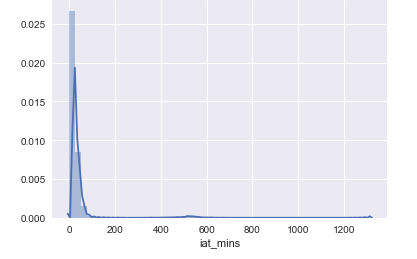

# Airlines-PandasSQL-Project
#### Import the pandas and warnings packages and reading the files
```
import pandas as pd
import warnings
warnings.filterwarnings(action='once')
```
#### Import the required datatime package
```
import datetime
from datetime import timedelta
```
#### Read the following files:
#### airlines.csv
#### airports.csv
#### flights.csv
#### planes.csv
#### weather.csv
```
airlines = pd.read_csv('airlines.csv')
airports = pd.read_csv('airports.csv')
flights = pd.read_csv('flights.csv')
planes = pd.read_csv('planes.csv')
weather = pd.read_csv('weather.csv')
print("The airlines files has {:d} rows".format(airlines.shape[0]))
print("The airports files has {:d} rows".format(airports.shape[0]))
print("The flights files has {:d} rows".format(flights.shape[0]))
print("The planes files has {:d} rows".format(planes.shape[0]))
print("The weather files has {:d} rows".format(weather.shape[0]))
```
The airlines files has 16 rows
The airports files has 1458 rows
The flights files has 336776 rows
The planes files has 3322 rows
The weather files has 26130 rows

#### After reading the files I will use the following steps:

#### I want to create file with arrival times and destinations only

#### To do that I will perform a series of ata manipulations shown below

#### The essential idea is to get data in form that can be ingested by the datetime function

#### Haved the data avalible to use. I will identify the five busiest airportw based on the number of arrivals per day

#### create five separate datasets for each of the five airports

#### Finally, provide the answers in the format requested

#### Start by investigating the relevant dataset
```
flights.head()
```
#### Keep the required fields only
```
flights = flights[['year', 'month', 'day', 'arr_time', 'dest']]
flights.head()
```
#### Identify if there are any missing values or NaNs in the dataset

```
flights.isnull().sum() 
```
year           0
month          0
day            0
arr_time    8713
dest           0
dtype: int64

#### Clearly the only NaNs are in the arr_time column, So delete those rows
```
flights = flights[pd.notnull(flights['arr_time'])]
flights.isnull().sum() 
```
year        0
month       0
day         0
arr_time    0
dest        0
dtype: int64
#### The next three steps are required to
#### convert arr_time to int
#### then to string
#### then to pad the left by a zero
#### to ensure that there are two numbers for hours and two numbers for minutes

#### Convert arr_time to int
```
flights.arr_time = flights.arr_time.astype(int)
flights.head()
```
#### Convert arr_time to str
```
flights.arr_time = flights.arr_time.astype(str)
flights.head()
```
#### Pad arr_time on the left with zero nd ensure a 4 character string
#### first two characters for hour
#### last two characters for minutes

```
flights['arr_time'] = flights['arr_time'].str.pad(4, side='left', fillchar='0')
flights.month = flights.month.astype(str)
flights['month'] = flights['month'].str.pad(2, side='left', fillchar='0')
```
#### Now ensure that month is of two characters length, pad with 0, if needed
```
flights.day = flights.day.astype(str)
flights['day'] = flights['day'].str.pad(2, side='left', fillchar='0')
```
#### Now ensure that day is of two characters length, pad with 0, if needed
```
flights['hour'] = flights.arr_time.str[:2]
flights['mins'] = flights.arr_time.str[2:]
```
#### Concatenate year, month, and day into a separte string variable called ymd. Note that this is done in two steps
```
flights['ym'] = flights.year.astype(str).str.cat(flights.month.astype(str), sep='-')
flights['ymd'] = flights.ym.astype(str).str.cat(flights.day.astype(str), sep='-')
```
#### Concatenate hour and mins into a separte string variable called hm
```
flights['hm'] = flights.hour.astype(str).str.cat(flights.mins.astype(str), sep=':')
```
#### Now, concatenate ymd and hm into the variable called arr_date_time
```
flights['arr_date_time'] = flights.ymd.astype(str).str.cat(flights.hm.astype(str), sep=' ')
```
#### Finally, create a variable called arrtime by converting the arr_date_time into the date format. Make sure that coerce the formation of this column; otherwise errors will result.
```
flights['arrtime'] = pd.to_datetime(flights['arr_date_time'], format ='%Y-%m-%d %H:%M', errors='coerce')
```
#### Keep only the variables that relevant to futher analysis
```
flights = flights[['arrtime', 'dest']]
```
	arrtime	dest
0	2013-01-01 08:30:00	IAH
1	2013-01-01 08:50:00	IAH
2	2013-01-01 09:23:00	MIA
3	2013-01-01 10:04:00	BQN
4	2013-01-01 08:12:00	AT
#### Identify how many malformed instances of the arrtime variable there are
```
flights.isnull().sum() 
```
arrtime    150
dest         0
dtype: int64

#### Delete those malformed instances to obtain a clean dataset
```
flights = flights[pd.notnull(flights['arrtime'])]
flights.isnull().sum() 
```
arrtime    0
dest       0
dtype: int64

#### Ready to identify the busiest airports in the list based on arrivals. First step is to list the unique destination airports

```
flights.dest.unique()
```
array(['IAH', 'MIA', 'BQN', 'ATL', 'ORD', 'FLL', 'IAD', 'MCO', 'PBI',
       'TPA', 'LAX', 'SFO', 'DFW', 'BOS', 'LAS', 'MSP', 'DTW', 'RSW',
       'SJU', 'PHX', 'BWI', 'CLT', 'BUF', 'DEN', 'SNA', 'MSY', 'SLC',
       'XNA', 'MKE', 'SEA', 'ROC', 'SYR', 'SRQ', 'RDU', 'CMH', 'JAX',
       'CHS', 'MEM', 'PIT', 'SAN', 'DCA', 'CLE', 'STL', 'MYR', 'JAC',
       'MDW', 'HNL', 'BNA', 'AUS', 'BTV', 'PHL', 'STT', 'EGE', 'AVL',
       'PWM', 'IND', 'SAV', 'CAK', 'HOU', 'LGB', 'DAY', 'ALB', 'BDL',
       'MHT', 'MSN', 'GSO', 'CVG', 'BUR', 'RIC', 'GSP', 'GRR', 'MCI',
       'ORF', 'SAT', 'SDF', 'PDX', 'SJC', 'OMA', 'CRW', 'OAK', 'SMF',
       'TUL', 'TYS', 'PVD', 'DSM', 'PSE', 'BHM', 'OKC', 'CAE', 'HDN',
       'BZN', 'MTJ', 'EYW', 'PSP', 'ACK', 'BGR', 'ABQ', 'ILM', 'MVY',
       'SBN', 'LEX', 'CHO', 'TVC', 'ANC'], dtype=object)
       
#### Count the number of arrivals at airports and sort them
#### The top five values give you the busiest airports, w.r.t. number of arrivals per day

```
pd.value_counts(flights['dest'].values, sort=True).head(5)
# if you want to see all values, remove the head() option from this command
```
ATL    16871
ORD    16607
LAX    16047
BOS    15020
MCO    13973
dtype: int64
#### Create five different datasets for the top five (busiest) airports
```
ATL = flights[flights['dest'] == 'ATL']
ORD = flights[flights['dest'] == 'ORD']
LAX = flights[flights['dest'] == 'LAX']
BOS = flights[flights['dest'] == 'BOS']
MCO = flights[flights['dest'] == 'MCO']
```
#### I will show detailes steps for ATL for obtaining interarrival times in minutes
#### Compute inter-arrival time for each airport file after sorting each file by date and arrival time
#### Convert that time to seconds
#### Convert seconds into minutes (by dividing by 60)
#### Use the diff function to obtain interarrival time in time format
```
iatATL = ATL.sort_values(by=['arrtime'])
iatATL['iat'] = iatATL['arrtime'].diff()
iatATL.head()
```
	arrtime	dest	iat
4	2013-01-01 08:12:00	ATL	NaT
29	2013-01-01 08:33:00	ATL	00:21:00
18	2013-01-01 08:37:00	ATL	00:04:00
23	2013-01-01 08:37:00	ATL	00:00:00
62	2013-01-01 09:44:00	ATL	01:07:00

#### Convert time into seconds
```
# Get arrival difference time in seconds
iatATL["iat_seconds"] = iatATL['iat'].dt.total_seconds()
iatATL.head()
```
	arrtime	dest	iat	iat_seconds
4	2013-01-01 08:12:00	ATL	NaT	NaN
29	2013-01-01 08:33:00	ATL	00:21:00	1260.0
18	2013-01-01 08:37:00	ATL	00:04:00	240.0
23	2013-01-01 08:37:00	ATL	00:00:00	0.0
62	2013-01-01 09:44:00	ATL	01:07:00	4020.0
#### Convert seconds into minutes
```
# Get arrival difference time in minutes
iatATL["iat_mins"] = iatATL['iat_seconds']/60
iatATL.head()
```
	arrtime	dest	iat	iat_seconds	iat_mins
4	2013-01-01 08:12:00	ATL	NaT	NaN	NaN
29	2013-01-01 08:33:00	ATL	00:21:00	1260.0	21.0
18	2013-01-01 08:37:00	ATL	00:04:00	240.0	4.0
23	2013-01-01 08:37:00	ATL	00:00:00	0.0	0.0
62	2013-01-01 09:44:00	ATL	01:07:00	4020.0	67.0

#### Obtain descriptive statistics for ATL
```
iatATL.describe().transpose()
print ('ATL: Mean = {0:.3f} and SD = {1:.3f}'.format(float(iatATL[['iat_mins']].mean()), 
                                                     float(iatATL[['iat_mins']].std())))
```
ATL: Mean = 31.118 and SD = 74.814

#### Now to plotting using seaborn
```
import seaborn as sns
%matplotlib inline
warnings.filterwarnings('ignore')
iatATL = iatATL.dropna()
sns.distplot(iatATL['iat_mins']);
```




